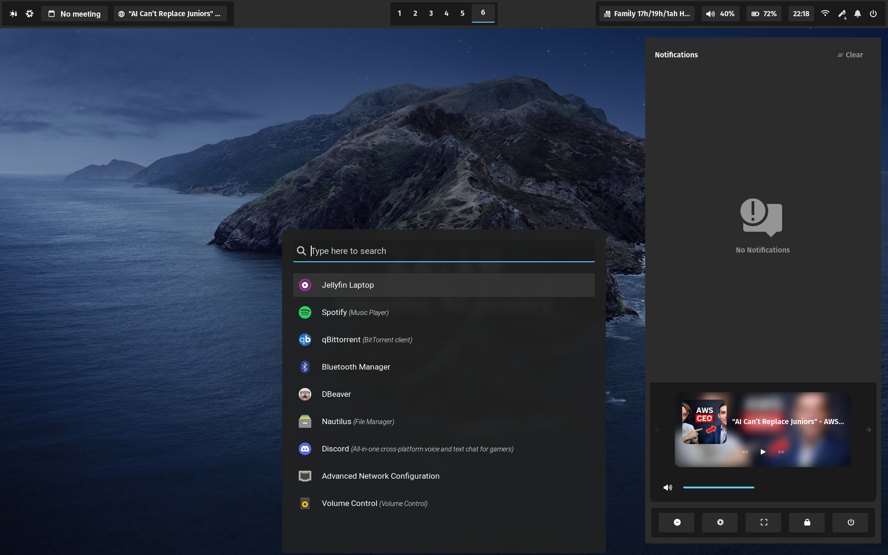
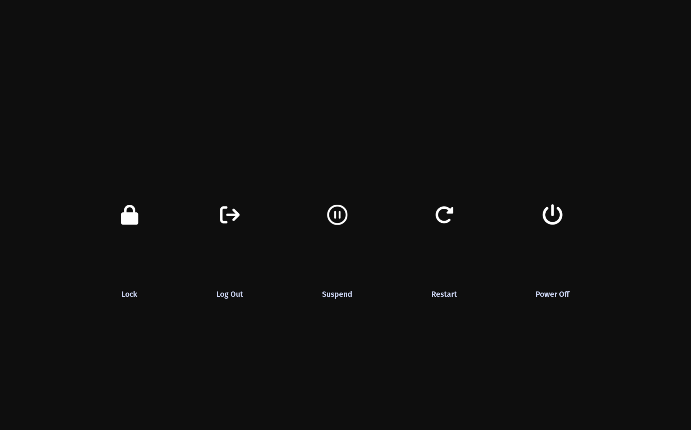

# NixOS Configuration

My personal NixOS dotfiles. 




## Features and key maps

Features include:

- Status bar
- Application launcher
- Notification daemon / menu
- Other application configurations (incl terminal configuration and tooling)
- configured tooling and dependencies for programming and my [neovim setup](https://github.com/Aleks-Tacconi/nvim-config).
- KDE connect for connecting mobile device to pc
- Different profiles for different devices
- `Tailscale` network setup
- Git configuration
> git identity is configured in `home.nix`
- `Jellyfin` media server
- `Syncthing` for syncing any two devices (currently disabled)
- `hyprlock` for lock screen
- Custom service for automatically syncing my obsidian notes (automatically pushed every 30 minutes if any changes)
> set up in `configuration/homemanagerconfig/services.nix`

### Status bar features

- Toggle `hyprsunset` button (night light)
- Open [nix packages](https://search.nixos.org/packages) button
- Google calendar integration (using [nextmeeting](https://github.com/chmouel/nextmeeting))
> `nextmeeting` needs to be cloned into `~/.nextmeeting` and set up with authentication (see `nextmeeting` github)
- Media player indicator (click to pause / resume)
- Open workspaces indicator
- Audio interface display (click to cycle selected audio interface)
- Volume indicator (scroll to adjust volume)
- Battery percentage
- Time (click to cycle between date / time)
- WiFi indicator (hover to show connected WiFi interface)o
- Notes button (click to open a `rofi` window with notes, type new note to add, select existing note to remove)
> You need to create a `~/.notes.md` file for this to work
- Notification indicator (click to open `swaync` panel)
- Power menu (click to open power menu)

### Key maps

> The leader key is Super (The windows button)

| Key map                                       | action |
|---------|--------|
| leader +i (where i is any integer)        | Go to workspace i       |
| leader + s                                     | Go special workspace       |
| leader + Shift + i (where i is any integer or s)        | Move selected application to workspace i |
| leader + Space                                 | Open application menu   |
| leader + n                                 | Open notification panel |
| leader + h / j / k / l | Move selection to application (vim keybinds represent direction) |
| leader + q | Open terminal (kitty) |
| leader + w | Open browser (brave) | 
| leader + e | Open file manager (nautilus) |
| leader + t | Reload status bar |


TODO: finish adding keybinds

## Installation and Set up

1. Clone the repository:
  
```bash
git clone git@github.com:Aleks-Tacconi/NixOSConfig.git
```

2. Navigate to the repository

```bash
cd NixOSConfig
```

3. Modify any instances of user / host name to match your desired username / host name's
4. Modify `core.nix` and `pc.nix` / `laptop.nix` (or add a new profile) to select desired applications (including adding the hardware configuration for that profile)
5. (Optional) configure `nextmeeting` and create a `~/.todo.md` for all features in the status bar (for more info see the status bar section above)
6. Switch to the configuration

```bash
make laptop
```

## Additional Info

The `Makefile` contains useful commands like `clean`, `git` and `update`
