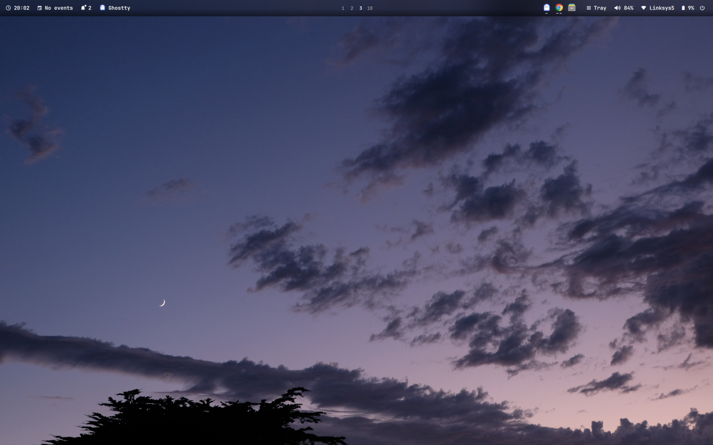
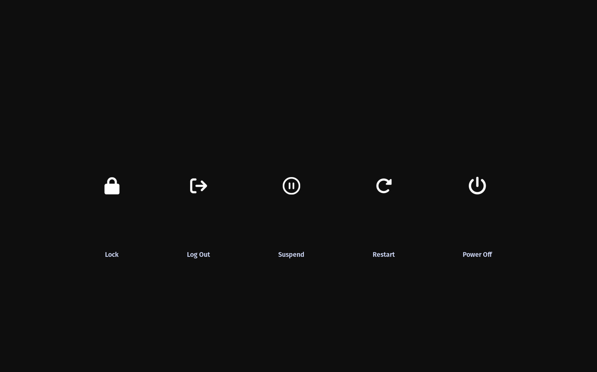

# NixOS Configuration

Personal NixOS and Home Manager configuration for my `laptop` and `pc` hosts.
The repository assumes the `aleks` user, host-specific hardware files, and my
monitor and storage layout. It is intended as a reference rather than a
drop-in configuration for another machine.




## Desktop

- Hyprland with host-specific monitor and workspace layouts.
- A Nix-managed Quickshell `minimal` configuration providing the top bar,
  launcher, dock, notifications, calendar, media controls, network and battery
  status, and power menu.
- Click-open top-bar panels dismiss after the pointer leaves their trigger and
  panel.
- Google Chrome as the default browser, with Helium and Firefox also installed.
- Ghostty, Nautilus, Hyprlock, SwayOSD, and Catppuccin/Papirus theming.
- KDE Connect and Jellyfin.
- Preservation-oriented Google Drive synchronization on both hosts.
- Syncthing synchronization for `~/ObsidianVault` between both hosts.
- OpenCode and selected global configuration files managed by Home Manager.

Quickshell's static configuration is deployed to
`~/.config/quickshell/minimal` from
`configuration/applications/quickshell/config/minimal`. Mutable dock pins are
stored in `~/.local/state/quickshell/minimal/dock-pins.json`.

OpenCode's `AGENTS.md`, `opencode.jsonc`, sandbox shell, and RTK plugin are
immutable Home Manager links sourced from `opencodeconfig/`. The surrounding
config and plugin directories remain writable for notifier state, dependencies,
and Herdr's generated integration.

## Google Drive

Both hosts keep a complete offline copy of the main Google Drive under
`~/Google Drive`. Each host runs its own `rclone bisync` session directly against
`gdrive:` on the same five-minute schedule. Both machines use the same package,
commands, state layout, and systemd units. User lingering keeps the timers active
after logout.

Set up each machine independently in either order. On each machine, authorize
rclone as `aleks` and initialize an empty local folder:

```bash
rclone config
rclone lsd gdrive:
gdrive-sync
gdrive-sync status
```

In `rclone config`, create a Google Drive remote named exactly `gdrive`, use
full Drive access, and complete the browser OAuth flow. A personal Google API
client ID is recommended for regular synchronization but is not required.
Credentials remain in `~/.config/rclone/rclone.conf`; do not add that file or
its OAuth tokens to this repository. Initialization refuses a non-empty
`~/Google Drive` and uses Drive as the authoritative first copy. Scheduled jobs
wait for the first successful manual `gdrive-sync`, which initializes the folder
when needed and activates subsequent five-minute synchronization automatically.

```bash
systemctl --user status google-drive-sync.timer
journalctl --user -u google-drive-sync.service -f
```

Create, edit, rename, move, or delete ordinary files normally inside
`~/Google Drive`. Bisync represents a move as a copy to the new path followed by
deletion of the old path, so it reaches Drive and the other host normally while
the old path is archived. Deletions propagate to Drive and the other host, but
they are not permanent: replaced or deleted local versions are moved under
`~/.local/state/gdrive-sync/backups/`, and Drive versions are moved under
`gdrive:.gdrive-sync/history/`. UUID-based run directories prevent history
collisions. Google Drive trash is also forced on.

When both hosts edit the same path before either synchronizes, the newer
modification time wins. The losing version is renamed with a numbered
`conflict` suffix instead of being discarded. A run
aborts before applying more than 1000 deletions at once. Transfer logs are stored
under `~/.local/state/gdrive-sync/reports/` and failures trigger a desktop
notification.

A daily cleanup keeps local backups and Drive history for 30 days, and transfer
reports for 14 days. Expired Drive history is deleted permanently from the
reserved history directory so it releases storage; active Drive files are never
touched by cleanup. Both machines use the same cleanup service, with a random
delay to reduce simultaneous remote cleanup.

Google-native Docs, Sheets, Slides, and Drawings appear in their normal
`~/Google Drive` hierarchy as `.url` files that open the real browser document.
They require an internet connection and are edited in Google Drive; no separate
offline export folder is created.

Paths whose file or directory name starts with uppercase `PRIVATE` are excluded
at any depth. For example, `PRIVATE-notes.txt` and `work/PRIVATE-project/` neither
upload nor download. The rule is case-sensitive. The reserved `.gdrive-sync`
directory is also excluded so archived versions cannot re-enter the live tree.

Useful manual commands are:

```bash
gdrive-sync
gdrive-sync status
```

Bisync never runs an automatic resync. If rclone reports that state recovery is
required, preserve any unsynchronized local work outside `~/Google Drive`, then
run a Drive-authoritative recovery:

```bash
gdrive-sync resync
```

The health check requires rclone's Google Drive backend and rejects disabled TLS
certificate verification. Transfers use certificate-validated HTTPS, so data
is encrypted in transit but remains readable by Google. Simultaneous runs can
overlap because Google Drive does not provide rclone with a distributed lock;
numbered conflicts and UUID-based histories provide recovery rather than an
absolute zero-loss guarantee.

## Syncthing

Syncthing runs as `aleks` on both hosts and synchronizes `~/ObsidianVault`.
Its web interface is available locally at <http://127.0.0.1:8384>. Device
discovery and transfer ports are open in the firewall, but the web interface is
not exposed to the network.

Set up the vault as follows:

1. Rebuild both hosts so Syncthing is running on each machine.
2. Open <http://127.0.0.1:8384> on both hosts.
3. On one host, select **Actions > Show ID** and copy its device ID.
4. On the other host, select **Add Remote Device**, enter that ID, give the
   device a recognizable name, and save it.
5. Accept the pending device request on the first host.
6. On the host containing the existing vault, select **Add Folder** and set the
   folder path to `/home/aleks/ObsidianVault`.
7. Select the other device under **Sharing**, then save the folder.
8. Accept the folder request on the other host and set its folder path to
   `/home/aleks/ObsidianVault`.
9. Wait until both hosts report **Up to Date**, then open that directory as a
   vault in Obsidian on each host.

Start with the existing vault on only one host and let Syncthing populate the
other host. Service status and logs are available with:

```bash
systemctl status syncthing.service
journalctl -u syncthing.service -f
```

## Repository Layout

| Path | Purpose |
| --- | --- |
| `flake.nix` | Flake inputs, both NixOS hosts, and the OpenCode development shell |
| `devices/core.nix` | Shared system and application imports |
| `devices/laptop.nix` | Laptop hardware and host-specific settings |
| `devices/pc.nix` | PC hardware and host-specific settings |
| `configuration/nixconfig/` | Core NixOS modules |
| `configuration/applications/` | Application-specific system and Home Manager modules |
| `configuration/homemanagerconfig/` | Shared user environment, theme, and desktop configuration |
| `home.nix` | Home Manager root for `aleks` |
| `opencodeconfig/` | Declarative OpenCode configuration |

## Keybindings

The leader key is Super.

| Key | Action |
| --- | --- |
| `Super+1` to `Super+9` | Switch workspace |
| `Super+Shift+1` to `Super+Shift+9` | Move the active window to a workspace |
| `Super+S` | Toggle the special workspace |
| `Super+Shift+S` | Move the active window to the special workspace |
| `Super+Space` | Open the Quickshell launcher |
| `Super+N` | Toggle the Quickshell notification center |
| `Super+Q` | Open Ghostty |
| `Super+W` | Open Google Chrome |
| `Super+E` | Open Nautilus |
| `Super+C` | Close the active window |
| `Super+V` | Toggle floating mode |
| `Super+F` | Toggle fullscreen |
| `Super+H/J/K/L` | Move focus |
| `Super+Shift+H/J/K/L` | Move the active window |
| `Alt+H/J/K/L` | Resize the active window |
| `Alt+Space` | Toggle media playback |
| `Print` | Capture a region |
| `Shift+Print` | Capture a window |

## Installation

1. Clone the repository.
2. Review the username, hardware configuration, boot device, monitor names,
   storage mounts, and host-specific settings under `devices/`.
3. Evaluate the selected host before switching:

```bash
nix build .#nixosConfigurations.laptop.config.system.build.toplevel --dry-run
```

4. Switch to the selected host:

```bash
sudo nixos-rebuild switch --flake .#laptop
```

Use `#pc` for the desktop host.

## Commands

| Command | Behavior |
| --- | --- |
| `nix flake check` | Evaluate the flake |
| `make laptop` | Mount the configured laptop boot partition if needed, stage all Git changes, and rebuild `laptop` |
| `make pc` | Stage all Git changes and rebuild `pc` |
| `make update` | Update all flake inputs |
| `make clean` | Remove old user/system profile history and run system and user garbage collection |
| `make git MSG="message"` | Stage, commit, and push to `origin/main` |
| `make all MSG="message"` | Update, commit, push, and rebuild the laptop |
| `nix develop .#opencode` | Enter the isolated OpenCode/Ollama development shell |

`make git` and `make all` push changes. `make clean` removes old generations.
Review their recipes before running them.

Utility targets in `RootMakefile` are invoked with
`make -f RootMakefile <target>`.
